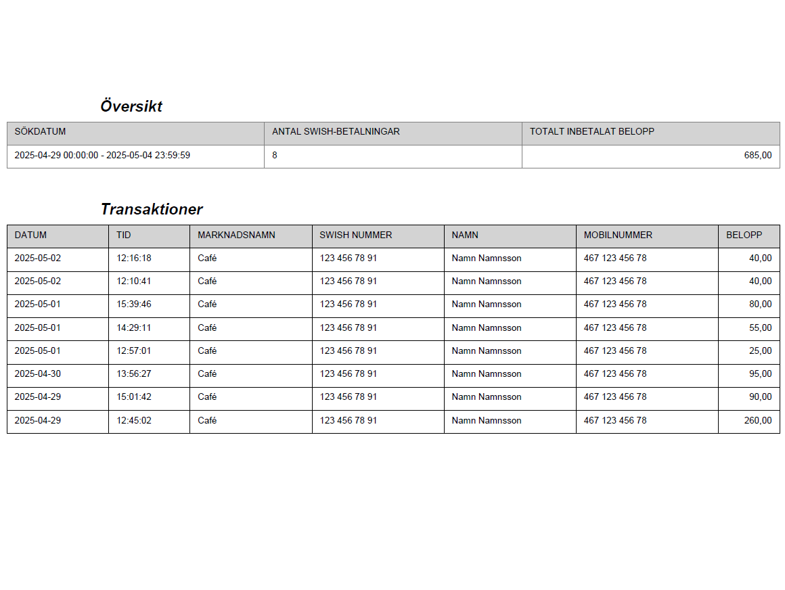

# CustomTkinter CSV to PDF Converter

This project is a simple application built using CustomTkinter that allows users to drag and drop a CSV file and convert it to a PDF file. The application provides a user-friendly interface for selecting the output location for the generated PDF.

## Features

- Drag and drop functionality for CSV file input.
- Button to select the output location for the PDF file.
- Conversion of CSV data to PDF format.
- Example output included to showcase the generated PDF layout.

## Requirements

To run this application, you need to have Python installed along with the following packages:

- customtkinter
- pandas
- reportlab
- tkinterdnd2

## Installation

1. Clone the repository:

   ```
   git clone https://github.com/Oliver-Timmerlid/Swish_Report_PDF.git
   ```

2. Navigate to the project directory:

   ```
   cd Swish_Report_PDF
   ```

3. Install the required packages:

   ```
   pip install -r requirements.txt
   ```

## Usage

1. Run the application:

   ```
   python src/app.py
   ```

2. Drag and drop your CSV file into the application window.

3. Click the button to select where to save the converted PDF file.

4. The application will convert the CSV file to PDF and save it to the specified location.

## Example Output

Below is an example of how the generated PDF will look:



## License

This project is licensed under the MIT License - see the [LICENSE](LICENSE) file for details.
